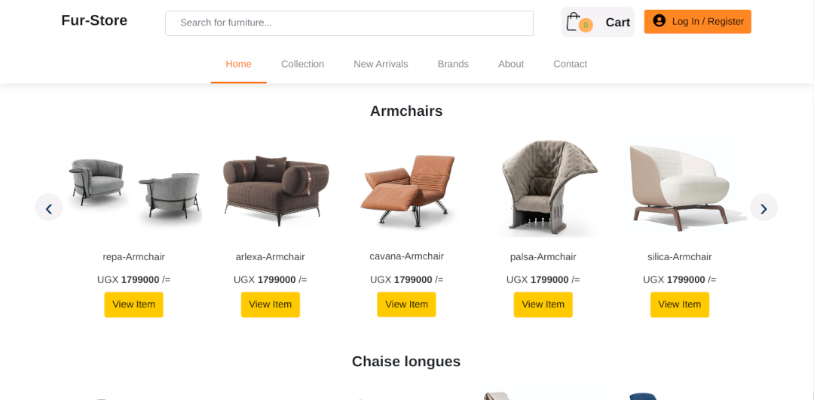
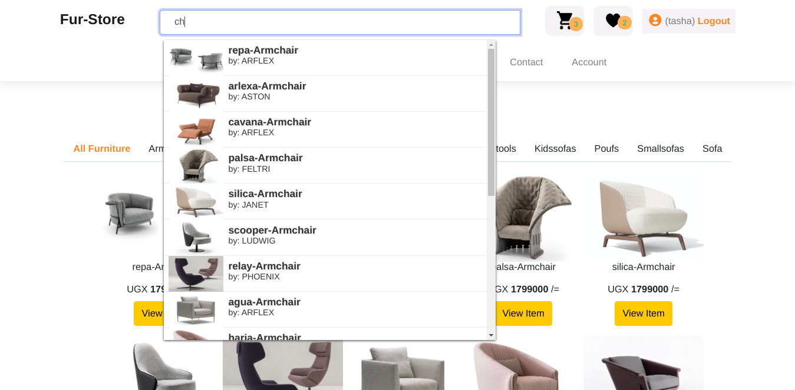

## __Furniture Application__ [E-commerce Project]

### Designed By
  > [ochen.hillary](https://github.com/occn8)
 

### Running Project
* [x] __Make sure__ xampp or `any-other` is started or running
* [x] __Move__ the project folder(__furniture-store__) to location 'PathTo'/lampp/htdocs/
* [x] __Then__ Paste this URL __`http://localhost/furniture-store/index.php`__ to your browser
* [x] __Done__

### Screenshots
<!-- __`Home screen`__
 -->
__`Search`__

